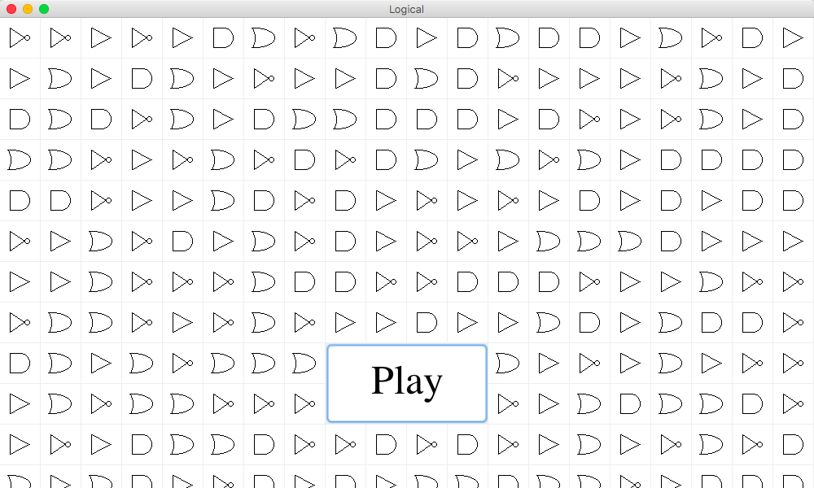
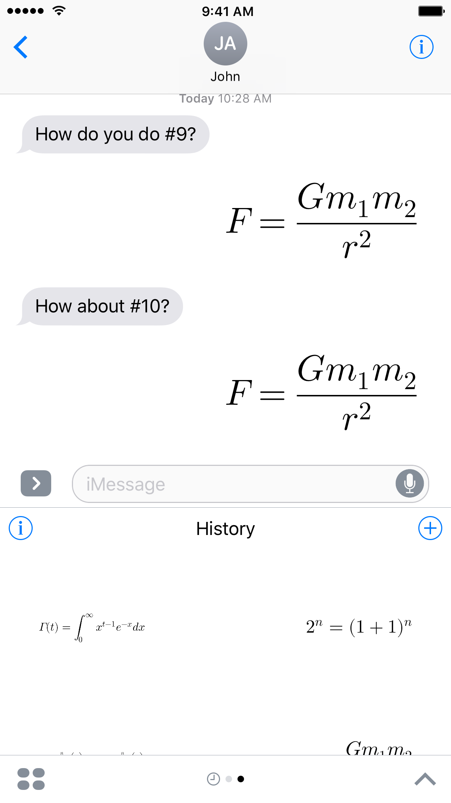

<h1 align="center">Hello.</h1>
My name is Saagar Jha, and I am currently a senior at Monta Vista High School in Cupertino, California. From an early age, I've had a passion for working with computers. Here's a sample of what I've created.

<blockquote style="font-size: smaller; background-color: #F4F4F4; padding: 0.5rem;">
	<p style="font-size: smaller; letter-spacing: 0.1rem; margin: 0.25rem;">NOTE:</p>
	<ol>
		<li>Much of this code is freely available, either on my <a href="https://github.com/saagarjha">Github</a> or <a href="https://bitbucket.org/saagarjha/">Bitbucket</a> accounts. While the code posted here is the same as what's online, on occasion I have added comments to make it more clear what is going on. Comments marked as <code>// [SNIPPED]</code> indicate that some code has been omitted from the file to keep it at a reasonable size.
		</li>
		<li>I created this portfolio using Github Gist (and subsequently moved to my website since it was too large to display)–you can find it <a href="http://saagarjha.com/about/portfolio/">here</a>. I chose writing this in a Gist because has the advantage of:
			<ul>
				<li>providing niceties such as code coloring and animated GIF support.</li>
				<li>being up-to-date. I crashed my bike recently, breaking my computer (and my clavicle, which, unlike my computer, is fixable). Unfortunately, this forces me to write this on a borrowed laptop, without access to some of my code. I'll update this as soon as I can get a new computer with what I missed.</li>
			</ul>
		</li>
	</ol>
</blockquote>

## Logical
Logical is a Java application I wrote for my ninth grade Java class as a final project of writing an "educational game". Logical teaches users Boolean algebra and logic gates by challenging them to build circuits that satisfy a set of demands with as few gates as possible. Unfortunately, while I have not been able to make the code publicly available so as to not run afoul of my school's Academic Honesty policy<sup>[1](#footnote1)</sup>, here are some relevant snippets and screenshots from the program:



<p align="center">The title screen. The play button looks a bit off, since we were required to use a <code>Layout</code> for our <code>JPanel</code>s. The gate images are drawn in code–it's sibling class is used for circuit creation below.</p>


<p align="center">Creating a XOR circuit. The red signifies that the gate hasn't been properly hooked up.</p>


<p align="center">A completed circuit, ready for checking. This one is incorrectly done, which the user will find out in a moment, as the tests are performed.</p>

```java
// [SNIPPED]
/*
 * Runs the circuit contained in BoardPanel.
 */
private class CircuitRunner extends SwingWorker<Void, SetData> {
	/**
	 * Overrides SwingWorker's doInBackground to run the circuit.
	 */
	protected Void doInBackground() {
		boolean matches = true;
		for (int i = 0; i < inputs.length; i++) {
			SetData sd;
			sd = new SetData(null, -1, -1, Color.YELLOW, i + 1);
			publish(sd);
			boolean[] output = bp.runCircuit(inputs[i]);
			ArrayList<Boolean> check = new ArrayList<Boolean>(output.length);
			ArrayList<Boolean> current = new ArrayList<Boolean>();
			ArrayList<Boolean> add = new ArrayList<Boolean>(output.length);
			for (int j = 0; j < output.length; j++) {
				check.add(outputs[i][j]);
				add.add(output[j]);
			}
			boolean good = checkPermutations(check, current, add);
			sd = new SetData(good + "", i + 1, inputs[i].length
					+ outputs[i].length, null, -1);
			publish(sd);
			if (good) {
				sd = new SetData(null, -1, -1, Color.WHITE, i + 1);
			} else {
				sd = new SetData(null, -1, -1, Level.LIGHT_RED, i + 1);
				matches = false;
			}
			publish(sd);
			try {
				Thread.sleep(DELAY);
			} catch (InterruptedException e) {
			}
		}
		if (matches) {
			message = "Level cleared!";
		} else {
			message = "Outputs don't match";
		}
		repaint();
		run.setEnabled(true);
		run.setText("Check");
		return null;
	}

	/**
	 * Overrides SwingWorker's process to call setLabel or setRowColor when
	 * needed.
	 */
	protected void process(List<SetData> data) {
		for (SetData sd : data) {
			if (sd.getS() != null && sd.getR() != -1 && sd.getC() != -1) {
				tp.setLabel(sd.getS(), sd.getR(), sd.getC());
			} else if (sd.getColor() != null && sd.getRow() != -1) {
				tp.setRowColor(sd.getColor(), sd.getRow());
			}
		}
	}
}
// [SNIPPED]
```
This code was the core of the animation for running the circuit. Since we weren't allowed to use the `Timer` class, I was forced to create a new `Thread` managed by `SwingWorker` to perform the checking of the circuit. Here's what it looks like in action:


<p align="center">Running the circuit checks. The testing is animated so that the user can see what failed–this one is almost done with the first test.</p>


<p align="center">Some checks failed–they're highlighted in red. The current check being performed is yellow.</p>


<p align="center">The circuit failed to pass all the checks–the user needs to fix the circuit.</p>


<p align="center">All checks passed–the level is cleared.</p>


<p align="center">An animated version.</p>


## MazeRunner/Flight Simulator
MazeRunner was initially a test program I wrote to get used to the [Processing Library](https://processing.org/) as well as the [Java Binding for OpenGL](http://jogamp.org/jogl/www/) for my AP Computer Science class in tenth grade. Initially modeled as a first-person environment viewer, it was retrofitted with a maze generation algorithm and made into a timed "first person escape the maze" game. The first-person view from this project was used to create Flight Simulator, which included random terrain generation using heightmaps created by a [Diamond-Square algorithm](https://en.wikipedia.org/wiki/Diamond-square_algorithm) modified for efficiency on the underpowered lab computers at school.

```java
// [SNIPPED]
void draw() {
	// Draw the sky
	background(SKY);
	// Remove old boxes
	clear();
	frame.setLocation(DFRAME, DFRAME);
	// Draw the ground
	fill(GROUND);
	pushMatrix();
	translate(0, GROUND_SIZE / 2 + SIZE, 0);
	box(GROUND_SIZE, GROUND_SIZE, GROUND_SIZE);
	popMatrix();
	// Draw the boxes that make up the maze
	fill(BOX);
	for (int[] p : grid) {
		pushMatrix();
		translate(p[0], p[1], p[2]);
		box(SIZE, SIZE, SIZE);
		popMatrix();
	}
	// Move to the player
	move();
	// Make sure the camera points the right direction
	camera(x, y, z, x + sin(ah), y + sin(av), z + cos(ah), 0, 1, 0);
}

void move() {
	if (d) { // D pressed
		int oldX = x;
		int oldY = y;
		int oldZ = z;
		x -= MOVE * cos(ah);
		z += MOVE * sin(ah);
		if (!boundCheck()) { // Make sure we don't collide with anything
			x = oldX;
			y = oldY;
			z = oldZ;
		}
	}
	if (w) { // W pressed
		int oldX = x;
		int oldY = y;
		int oldZ = z;
		x += MOVE * sin(ah);
		z += MOVE * cos(ah);
		if (!boundCheck()) { // Make sure we don't collide with anything
			x = oldX;
			y = oldY;
			z = oldZ;
		}
	}
	if (a) { // A pressed
		int oldX = x;
		int oldY = y;
		int oldZ = z;
		x += MOVE * cos(ah);
		z -= MOVE * sin(ah);
		if (!boundCheck()) { // Make sure we don't collide with anything
			x = oldX;
			y = oldY;
			z = oldZ;
		}
	}
	if (s) { // S pressed
		int oldX = x;
		int oldY = y;
		int oldZ = z;
		x -= MOVE * sin(ah);
		z -= MOVE * cos(ah);
		if (!boundCheck()) { // Make sure we don't collide with anything
			x = oldX;
			y = oldY;
			z = oldZ;
		}
	}
	checkDone();
}
// [SNIPPED]
```
The 3D drawing and moving code, mostly shared between MazeRunner and Flight Simulator.


<p align="center">What the maze in MazeRunner looks like. This has been version has been hacked to allow for moving up to view the whole maze. This is also why the horizon seems "off"–that's actually the maximum draw distance.</p>

```java
// [SNIPPED]
// Create an initial heightmap
void generateTerrain(int topR, int topC, int size) {
	float tl = terrain[topR][topC];
	float tr = terrain[topR][topC + size];
	float bl = terrain[topR + size][topC];
	float br = terrain[topR + size][topC + size];
	float newTerrain = (tl + tr + bl + br) / 4.0 + random(-ratio, ratio) * size;
	terrain[topR + size / 2][topC + size / 2] = newTerrain;
	if (size != 0) {
		generateTerrain(topR, topC, size / 2);
		generateTerrain(topR, topC + size / 2 + 1, size / 2);
		generateTerrain(topR + size / 2 + 1, topC, size / 2);
		generateTerrain(topR + size / 2 + 1, topC + size / 2 + 1, size / 2);
	}
}

// Clean up the heightmap, to make it look more realistic
void smoothTerrain(int size) {
	float[][] oldTerrain = new float[terrain.length + 2 * size][terrain[0].length + 2 * size];
	for (int r = 0; r < terrain.length; r++) {
		for (int c = 0; c < terrain[r].length; c++) {
			oldTerrain[r + size][c + size] = terrain[r][c];
		}
	}
	for (int r = size; r < oldTerrain.length - size; r++) {
		for (int c = size; c < oldTerrain[r].length - size; c++) {
			float a = 0;
			for (int r2 = r - size; r2 < r + size; r2++) {
				for (int c2 = c - size; c2 < c + size; c2++) {
					a += oldTerrain[r2][c2];
				}
			}
			terrain[r - size][c - size] = a / size / size / 4;
		}
	}
}

// [SNIPPED]

void draw() {
	// Draw the sky
	background(SKY);
	perspective(FOV, ASPECT, NEARZ, FARZ);
	directionalLight(255, 255, 255, 1, 1, 1);
	noStroke();
	// Draw the water/ground
	fill(GROUND);
	pushMatrix();
	translate(GRID * SIZE / 2, GROUND_SIZE / 2 + SIZE, GRID * SIZE / 2);
	box(GROUND_SIZE, GROUND_SIZE, GROUND_SIZE);
	popMatrix();
	// Draw the terrain, based on the heightmap
	fill(BOX);
	for (int r = 1; r < terrain.length - 1; r++) {
		for (int c = 1; c < terrain.length - 1; c++) {
			// FARZ is the draw distance
			if (abs(r * SIZE - x) <= FARZ + SIZE && abs(c * SIZE - z) <= FARZ + SIZE) {
				beginShape();
				if (r == 0 && c == 0) {
					vertex(SIZE * (r - 1), 0, SIZE * (c - 1));
				} else {
					vertex(SIZE * (r - 1), terrain[r - 1][c - 1] * SIZE, SIZE * (c - 1));
				}
				if (r == 0) {
					vertex(SIZE * (r - 1), 0, SIZE * (c));
				} else {
					vertex(SIZE * (r - 1), terrain[r - 1][c] * SIZE, SIZE * (c));
				}
				vertex(SIZE * (r), terrain[r][c] * SIZE, SIZE * (c));
				endShape();
				beginShape();
				vertex(SIZE * (r - 1), terrain[r - 1][c - 1] * SIZE, SIZE * (c - 1));
				vertex(SIZE * (r), terrain[r][c - 1] * SIZE, SIZE * (c - 1));
				vertex(SIZE * (r), terrain[r][c] * SIZE, SIZE * (c));
				endShape();
			}
		}
	}
	move();
	camera(x, y, z, x + sin(ay), y - sin(ax), z + cos(ay) * cos(ax), sin(az), cos(ax) * cos(az), 0);
}

// [SNIPPED]
```
This code generates the heightmap for Flight Simulator, and draws it, using a modified Diamond-Square algorithm.


<p align="center">The terrain generated with Flight Simulator, viewed from the aircraft.</p>

## SmartHome
I wrote this in the summer of 2015 for a research project on home automation. This was my first "major" app for iOS (in the sense that it was a complete, useful product) I had written in Swift. SmartHome allowed users to control pre-programmed Bluetooth enabled devices (which I along with a couple of my friends wrote the code for), such as lights, motion sensors, and other "smart" appliances. The code no longer compiles due to changes made in Swift 2 and 3, but I still have the app binary on my phone to control my bedroom lights.


<p align="center">One of the PCBs used to control appliances; this one is from <a href="http://www.csr.com">CSR</a>. This one is currently being tested for a voltage drop to make sure that it was running the code that I had loaded on it (from the computer on the left, through the black USB cable). Off-camera, my phone is detecting <a href="https://en.wikipedia.org/wiki/Received_signal_strength_indication">RSSI</a> values to determine Bluetooth signal strength.</p>

```swift
// [SNIPPED]
func didConnect() {
    connected = true
    connect.title = "Disconnect"
    peripheral.discoverServices(nil)
}

func newService() {
    services = peripheral.services!
    dispatch_async(dispatch_get_main_queue() {
    	self.tableView.reloadData()
    }
}

func findCharacteristics(service: CBService) {
    peripheral.discoverCharacteristics(nil, forService: service)
}

func peripheral(peripheral: CBPeripheral, didUpdateValueForCharacteristic characteristic: CBCharacteristic,
	error: NSError) {
    if characteristic.properties == .Read {
        if let value = characteristic.value {
            characteristicsView.newCharacteristic(characteristic, value: value)
            peripheral.setNotifyValue(true, forCharacteristic: characteristic)
        }
    }
}
// [SNIPPED]
```

Some of the Bluetooth accessory discovery code, which relies on `CoreBluetooth`. Unfortunately, this will fail to compile currently due to the "Swiftication" of the Grand Central Dispatch APIs in Swift 3.


<p align="center">Promotional art I made from SmartHome screenshots.</p>

## Open AdBlock
This was the first open source project that I had written myself (as well as my first project with both Swift and Objective-C in it). While I had contributed code to other open source projects (such as [GBA4iOS](https://bitbucket.org/rileytestut/gba4ios) to get it [to compile on iOS 9 as well as fix some crashes](https://bitbucket.org/rileytestut/gba4ios/pull-requests/14/fixed-build-errors-and-some-crashes-some/diff)), this was the first project that I had written the code for start to finish. Open AdBlock initially leveraged a new feature in iOS 9, called content blocking, to block ads in Safari. However, when Apple dropped support for content blocking on 32-bit devices, I rewrote it from scratch to add support for 32-bit back. This required disassembling the SafariServices framework, which provided content blocking, and adding the features that Apple took out. **Open AdBlock is currently the first and only ad blocker in the world for both 32-bit and 64-bit iOS devices, without a jailbreak** (other ad blockers only support iPhone 5s and newer). The source code for Open AdBlock is available on [Github](https://github.com/saagarjha/OpenAdBlock). Here's the core of how it works:

```objectivec
// [SNIPPED]
@interface OABGestaltFixer : NSObject
+ (void)fixGestalt; // Method to trick Apple into thinking the device is 64 bit
@end

@interface NSExtension : NSObject
@end

@interface NSExtension (OpenAdBlock)
	@property (nonatomic, copy) NSString *identifier;
@end

// Methods reverse engineered using a combination of class-dump, lldb, and Hopper Disassembler
@interface SFContentBlockerManager (OpenAdBlock)
+ (SFContentBlockerManager*)sharedManager;
// Find out content blocker
- (void)_beginContentBlockerDiscovery;
// Force our content blocker to load
- (void)_loadContentBlockerWithIdentifier:(NSString *)arg1 completionHandler:(void(^)(NSError *))arg2;
- (BOOL)extensionIsEnabled:(NSExtension *)arg1;
// Set our extension as "enabled" so iOS is required to use it
- (void)setExtension:(NSExtension *)arg1 isEnabled:(BOOL)arg2;
- (NSArray*)extensions;
@end
// [SNIPPED]
```

```objectivec
// [SNIPPED]
#import <dlfcn.h>
#import "fishhook.h"
#import <Foundation/Foundation.h>
#import "OpenAdBlock-Bridging-Header.h"

@implementation OABGestaltFixer

static BOOL (*OGGetBoolAnswer)(NSString *question); // Pointer to the original implementation
static BOOL OABGetBoolAnswer(NSString *question) { // Our "hacked" method
	// Apple's 64-bit check. Return YES for this; otherwise return the real value
	return [question isEqual:@"s+gaKNe68Gs3PfqKrZhi1w"] ? YES : OGGetBoolAnswer(question);
}


+ (void)fixGestalt {
	// Get the original method
	OGGetBoolAnswer = dlsym(dlopen("/usr/lib/libMobileGestalt.dylib", RTLD_LAZY), "MGGetBoolAnswer");
	// Swap our "hacked" method with the real one using fishhook
	rebind_symbols((struct rebinding[1]) {{"MGGetBoolAnswer", OABGetBoolAnswer}}, 1);
}


@end
// [SNIPPED]
```

The above two Objective-C files trick iOS into allowing content blockers by spoofing that the device is 64-bit, allowing for the actual loading of Open AdBlock in the Swift file below:

```swift
// [SNIPPED]
// Call our "spoofing method"
OABGestaltFixer.fixGestalt()
// Search for Open AdBlock
SFContentBlockerManager.shared()._beginContentBlockerDiscovery()
// Load Open AdBlock
SFContentBlockerManager.shared()._loadContentBlocker(withIdentifier:
	"\(Bundle.main.bundleIdentifier!).ContentBlocker") { error in
	if let error = error {
		print(error)
	}
	// Wait a bit for iOS to catch up
	DispatchQueue.main.asyncAfter(deadline: .now() + .seconds(5)) {
		if let error = error {
			print(error)
		}
		// Go through all content blockers
		for e in SFContentBlockerManager.shared().extensions() as? [NSExtension] ?? [] {
			print(e)
			// Find Open AdBlock
			if e.identifier == "\(Bundle.main.bundleIdentifier!).ContentBlocker" {
				// Enable it
				SFContentBlockerManager.shared().setExtension(e, isEnabled: true)
			}
		}
		// Tell iOS that Open AdBlock has been enabled, so it can use it
		SFContentBlockerManager.reloadContentBlocker(withIdentifier:
			"\(Bundle.main.bundleIdentifier!).ContentBlocker", completionHandler: nil)
	}
}
// [SNIPPED]
```


<p align="center">The `SafariServices` framework, disassembled. Notice the string <code>"s+gaKNe68Gs3PfqKrZhi1w"</code> and the reference to <code>MGGetBoolAnswer</code>–they're the core of Apple's checks, and must be circumvented in my app.</p>

## Vulcanize
I wrote Vulcanize in Swift to help me get send math and physics formulas through iMessage. Vulcanize allows users to type in LaTeX formulas have have them be converted to pretty-printed math formulas when they're sent. **Vulcanize is available on the [App Store](https://itunes.apple.com/bw/app/vulcanize/id1154777474?mt=8)**, however I haven't gotten around to posting the source code online yet (it needs a bit of cleaning up and commenting, and I never post code that I don't believe is well written).

 
 

<p align="center">Screenshots of Vulcanize from its App Store page</p>

## Pool
Pool is an app I wrote in 12 hours for CU Hacks. Since many people want to carpool, but aren't able to find anyone to carpool with, Pool aims to be a ridesharing app to help users find carpoolers. It takes into account start and end locations, and then matches users with those who have similar routes. Pool allows users to advertise their own rides as well, so that they can find carpoolers. While CU Hacks is a team competition (teams of up to 4 people), I worked on Pool solo and won second place.

 
 

<p align="center">Screenshots of Pool from the Hackathon</p>

## ions
ions is a program that I wrote to help me and some fellow students get through my AP Chemistry class. It's written in C for calculators with the Motorola 68000 processor (i.e. TI-89, TI-92, and Voyage 200) for the purpose of making it easy to look up common ions and their properties. The source code as well as prebuilt files are available on [Github](https://github.com/saagarjha/ions).

```c
#define USE_TI89
#define USE_TI92PLUS
#define USE_V200
#define SAVE_SCREEN

#include <compat.h>
#include <ctype.h>
#include <graph.h>
#include <kbd.h>
#include <stdio.h>
#include <stdlib.h>

// Number added to a key when 2nd is pressed
#define KEY_2ND (4096)
// Number returned when the Home key is pressed
#define KEY_HOME (277)

// Height of one line, in pixels
#define LINE_HEIGHT (8)
// Number of lines to show
#define LINES (LCD_HEIGHT / LINE_HEIGHT + 1)
// x-position of the ion's name, in pixels
#define NAME_X (0)
// x-position of the ion's formula, in pixels
#define FORMULA_X (100)
// x-position of the ion's charge, in pixels
#define CHARGE_X (140)

// Key values returned by ngetchx(), mapped to 'a'-'z'
const short keymap[] = {
	'=',
	'(',
	')',
	',',
	'/',
	'|',
	'7',
	'8',
	'9',
	'*',
	149, // the 'EE' ('k') key
	'4',
	'5',
	'6',
	'-',
	KEY_STO,
	'1',
	'2',
	'3',
	't',
	'+',
	'0',
	'.',
	'x',
	'y',
	'z',
};

struct ion {
	char *name;
	char *formula;
	char *charge;
};

const struct ion ions[] = {
	{"Acetate", "C2H3O2", "-1"},
	{"Aluminum", "Al", "+3"},
	// [SNIPPED] 105 more ions, from Amide to Titanium (II, III, IV)
	{"Zinc", "Zn", "+2"},
	{"Zirconium (II,III,IV)", "Zr", "+1"},
};
const int ions_length = 109;

// Indices to scroll to for each letter
const int indices[] = {
	0,
	8,
	19,
	39,
	41,
	41,
	43,
	44,
	54,
	60,
	60,
	60,
	62,
	70,
	74,
	77,
	88,
	88,
	88,
	102,
	107,
	107,
	107,
	107,
	107,
	107,
};

// Draws everything on the line specified and below; line is zero indexed
void scroll(int line) {
	clrscr();
	int i;
	FontSetSys(F_4x6);
	for (i = 0; i < LINES; ++i) {
		if (line + i < 0 || ions_length <= line + i) { // off the screen
			continue;
		} else {
			DrawStr(NAME_X, LINE_HEIGHT * i, ions[line + i].name, A_NORMAL);
			DrawStr(FORMULA_X, LINE_HEIGHT * i, ions[line + i].formula, A_NORMAL);
			DrawStr(CHARGE_X, LINE_HEIGHT * i, ions[line + i].charge, A_NORMAL);
		}
	}
}

// Keep line on the screen
inline int clamp(int line) {
	return min(ions_length - LINES + 1, max(line, 0));
}

// Returns the
int key_index(short key) {
	if (isalpha(key)) {
		return indices[tolower(key) - 'a'];
	}
	int i;
	for (i = 0; i < 26; ++i) {
		if (key == keymap[i] ||
		        key - KEY_2ND == keymap[i] ||
		        key - KEY_DIAMOND == keymap[i]) {
			return indices[i];
		}
	}
	return -1;
}

void _main() {
	FontSetSys(F_4x6);
	int line;
	scroll(line = 0);
	for (;;) {
		short key = ngetchx();
		if (key == KEY_ESC || key == KEY_HOME || key - KEY_2ND == KEY_ESC) {
			exit(0);
		} else if (key == KEY_UP) {
			scroll(line = clamp(--line)); // up one
			continue;
		} else if (key - KEY_2ND == KEY_UP) {
			scroll(line = clamp(line -= 5)); // up five
			continue;
		} else if (key - KEY_DIAMOND == KEY_UP) {
			scroll(line = clamp(line = 0)); // top
		} else if (key == KEY_DOWN) {
			scroll(line = clamp(++line)); // down one
			continue;
		} else if (key - KEY_2ND == KEY_DOWN) {
			scroll(line = clamp(line += 5)); // down five
			continue;
		} else if (key - KEY_DIAMOND == KEY_DOWN) {
			scroll(line = clamp(line = ions_length)); // bottom
		}

		// handle alphabetic keypresses
		int index;
		if ((index = key_index(key)) >= 0) {
			scroll(line = clamp(index));
		}
	}
}
```

This C might looks slightly "off" (like that funky `_main`)–and in fact it is! It was written for to be cross-compiled for the m68k chipset and with [TIGCC](http://tigcc.ticalc.org/), which has rather different conventions than ISO C. It may appear that it must be difficult to maintain the long arrays that I included (not to mention the 105 ions that I omitted...), and thus this program comes bundled with another one (in standard C this time!) to be run on a normal computer for generating these lists, given a set of ions:

```c
#include <stdio.h>
#include <stdlib.h>
#include <string.h>
#include <ctype.h>

#define IONS_SIZE 1000
#define NAME_SIZE 50
#define FORMULA_SIZE 15
#define CHARGE_SIZE 5
#define ALPHABET "abcdefghijklmnopqrstuvwxyz\x7E" // the last character is to know where to stop
#define ALPHA_SIZE 26

struct ion {
	char name[NAME_SIZE];
	char formula[FORMULA_SIZE];
	char charge[CHARGE_SIZE];
};

int ion_comp(const void *ion1, const void* ion2) {
	return strcasecmp(((struct ion*)ion1)->name, ((struct ion*)ion2)->name);
}

int main(int argc, char **argv) {
	FILE *input;
	FILE *output;
	switch (argc) {
	case 0:
	case 1:
		printf("ionconv usage:\nionconv inputfile [outputfile]\n");
		return 1;
	case 2:
		input = fopen(argv[1], "r");
		output = stdout;
		break;
	default:
		if (!(input = fopen(argv[1], "r"))) {
			printf("Could not read from %s\n", argv[1]);
			return 2;
		}
		output = fopen(argv[2], "w+");
		break;
	}
	char name[NAME_SIZE], formula[FORMULA_SIZE], charge[CHARGE_SIZE];
	struct ion ions[IONS_SIZE];
	int i;
	for (i = 0; fgets(name, NAME_SIZE, input) &&
	        fgets(formula, FORMULA_SIZE, input) &&
	        fgets(charge, CHARGE_SIZE, input); ++i) {
		// trim newlines
		strtok(name, "\n");
		strtok(formula, "\n");
		strtok(charge, "\n");
		strcpy(ions[i].name, name);
		strcpy(ions[i].formula, formula);
		strcpy(ions[i].charge, charge);
	}
	qsort(ions, i, sizeof(*ions), *ion_comp);
	int total_ions = i;
	for (i = 0; i < total_ions; ++i) {
		fprintf(output, "{\"%s\", \"%s\", \"%s\"},\n", ions[i].name, ions[i].formula, ions[i].charge);
	}
	fprintf(output, "\n");
	fprintf(output, "%d\n\n", total_ions);
	char *letter = ALPHABET;
	for (i = 0; i < total_ions; ++i) {
		char first = tolower(*ions[i].name);
		while (first >= *letter) {
			letter++;
			fprintf(output, "%d,\n", i);
		}
	}
}
```


<p align="center">Screenshot of ions from my TI-89 (which is why the resolution is poor; the TI-89 is 160x100).</p>

## break
I consider break to be *the* best software I have ever written. Originally a drop-in replacement for the SchoolLoop app for iOS that my school uses for grade management and viewing, it has grown into much more. I have spent almost a year on it, and while it is still being tested by a couple dozen testers in different schools around California using Apple's [TestFlight](https://developer.apple.com/testflight/) service, I am nearing completion and eventual submission to the App Store. Written in more than 5000 lines of pure Swift, it is a "is a lightweight, native app for accessing SchoolLoop. It aims to provide an easier to use, more feature rich alternative to the official SchoolLoop iOS and Android apps."<sup>[2](#footnote2)</sup> Aiming to fix the frustrations I encountered in the official apps, I reverse-engineered SchoolLoop's grade API endpoints by intercepting the packets the app sent out, which I used in break. break also includes dozens of features that the official app does not include, such as the ability to mark assignments as complete, access a the file locker from a mobile device, preview files, among others. Finally, it deeply leverages existing Apple technologies such as 3D Touch, watchOS APIs, Grand Central Dispatch, QuickLook, Notifications, and TouchID, to make it seamless, well written, and efficient. break's source code is available on [Github](https://github.com/saagarjha/break). Here's the core of the program (quite a bit is removed, since the file is 700+ lines long):

```swift
// [SNIPPED]
@objc(SchoolLoop)
class SchoolLoop: NSObject, NSCoding {
	// Variables (there's a bunch, this around half of them)
	// Plus initialization, which has been cut out
	static var sharedInstance = SchoolLoop()
	let keychain = SchoolLoopKeychain.sharedInstance

	var school: SchoolLoopSchool!
	var schools: [SchoolLoopSchool] = []
	var account: SchoolLoopAccount!
	var courses: [SchoolLoopCourse] = []
	var assignments: [SchoolLoopAssignment] = []
	var assignmentsWithDueDates: [Date: [SchoolLoopAssignment]] {
		get {
			var awdd: [Date: [SchoolLoopAssignment]] = [:]
			for assigment in assignments {
				var assignmentsForDate = awdd[assigment.dueDate] ?? []
				assignmentsForDate.append(assigment)
				awdd[assigment.dueDate] = assignmentsForDate
			}
			return awdd
		}
	}

	// [SNIPPED]

	// One of half a dozen methods that interact with SchoolLoop's APIs
	// This one gets grades for a a certain class
	func getGrades(withPeriodID periodID: String, completionHandler:
			((_ error: SchoolLoopError) -> Void)?) {
		// The API endpoint
		let url = SchoolLoopConstants.gradeURL(withDomainName: school.domainName, studentID:
			account.studentID, periodID: periodID)
		// Set the username and password
		let request = authenticatedRequest(withURL: url)
		let session = URLSession.shared
		session.dataTask(with: request) { (data, response, error) in
			guard error == nil else {
				completionHandler?(.networkError)
				return
			}
			guard let course = self.course(forPeriodID: periodID) else {
				completionHandler?(.doesNotExistError)
				return
			}
			// Remove old data
			course.categories.removeAll()
			course.grades.removeAll()
			course.trendScores.removeAll()
			// Parse the JSON
			guard let data = data,
				let dataJSON = try? JSONSerialization.jsonObject(with: data, options:
					.allowFragments) as? [AnyObject] else {
					completionHandler?(.parseError)
					return
			}
			guard let categoriesJSON = (dataJSON?.first as? [String: AnyObject])?["categories"]
				as? [AnyObject] else {
				completionHandler?(.parseError)
				return
			}
			for categoryJSON in categoriesJSON {
				guard let categoryJSON = categoryJSON as? [String: AnyObject] else {
					completionHandler?(.parseError)
					return
				}
				// Extract category data from the JSON
				let name = categoryJSON["name"] as? String ?? ""
				let score = categoryJSON["score"] as? String ?? ""
				let weight = categoryJSON["weight"] as? String ?? ""
				let category = SchoolLoopCategory(name: name, score: score, weight: weight)
				course.categories.append(category)

			}
			// This wacko naming isn't mine-it's SchoolLoop's
			guard let GradingScaleJSON = (dataJSON?.first as? [String: AnyObject])?
				["GradingScale"] as? [String: AnyObject], let CutoffsJSON =
				GradingScaleJSON["Cutoffs"] as? [AnyObject] else {
				completionHandler?(.parseError)
				return
			}
			// Again, SchoolLoop's naming, not mine
			for CutoffJSON in CutoffsJSON {
				guard let CutoffJSON = CutoffJSON as? [String: AnyObject] else {
					completionHandler?(.parseError)
					return
				}
				let Name = CutoffJSON["Name"] as? String ?? ""
				let Start = CutoffJSON["Start"] as? String ?? ""
				let cutoff = SchoolLoopCutoff(Name: Name, Start: Start)
				course.cutoffs.append(cutoff)

			}
			guard let gradesJSON = (dataJSON?.first as? [String: AnyObject])?["grades"]
				as? [AnyObject] else {
				completionHandler?(.parseError)
				return
			}
			for gradeJSON in gradesJSON {
				guard let gradeJSON = gradeJSON as? [String: AnyObject] else {
					completionHandler?(.parseError)
					return
				}
				// Extract grade data from the JSON, such as assignment name, score, etc.
				let percentScore = gradeJSON["percentScore"] as? String ?? ""
				let score = gradeJSON["score"] as? String ?? ""
				let comment = gradeJSON["comment"] as? String ?? ""
				let changedDate = gradeJSON["changedDate"] as? String ?? ""
				guard let assignmentJSON = gradeJSON["assignment"] as? [String: AnyObject] else {
					completionHandler?(.parseError)
					return
				}
				let title = assignmentJSON["title"] as? String ?? ""
				let categoryName = assignmentJSON["categoryName"] as? String ?? ""
				let maxPoints = assignmentJSON["maxPoints"] as? String ?? ""
				let systemID = assignmentJSON["systemID"] as? String ?? ""
				let dueDate = assignmentJSON["dueDate"] as? String ?? ""
				let grade = SchoolLoopGrade(title: title, categoryName: categoryName,
					percentScore: percentScore, score: score, maxPoints: maxPoints,
					comment: comment, systemID: systemID, dueDate: dueDate, changedDate: changedDate)
				course.grades.append(grade)
			}
			guard let trendScoresJSON = (dataJSON?.first as? [String: AnyObject])?["trendScores"]
				as? [AnyObject] else {
				completionHandler?(.trendScoreError)
				return
			}
			// Trendscores for drawing the grade trend graph
			for trendScoreJSON in trendScoresJSON {
				guard let trendScoreJSON = trendScoreJSON as? [String: AnyObject] else {
					completionHandler?(.parseError)
					return
				}
				let score = trendScoreJSON["score"] as? String ?? ""
				let dayID = trendScoreJSON["dayID"] as? String ?? ""
				let trendScore = SchoolLoopTrendScore(score: score, dayID: dayID)
				course.trendScores.append(trendScore)
			}
			#if os(iOS)
				(UIApplication.shared.delegate as? AppDelegate)?.saveCache()
			#endif
			completionHandler?(.noError)
		}.resume()
	}

	// [SNIPPED]

	// Method to get the locker; this one is interesting because it returns XML instead of JSON
	func getLocker(withPath path: String, completionHandler: ((_ error: SchoolLoopError) -> Void)?) {
		let url = SchoolLoopConstants.lockerURL(withPath: path, domainName: school.domainName,
			username: account.username)
		var request = authenticatedRequest(withURL: url)
		// The locker is stored in a WebDAV server, so we need to use PROPFIND
		request.httpMethod = "PROPFIND"
		let session = URLSession.shared
		session.dataTask(with: request) { (data, response, error) in
			guard let data = data else {
				completionHandler?(.parseError)
				return
			}
			let parser = XMLParser(data: data)
			parser.delegate = self
			if !parser.parse() {
				completionHandler?(.parseError)
				return
			} else {
				completionHandler?(.noError)
			}
		}.resume()
	}

	// Assigns the username and password to the correct header
	func authenticatedRequest(withURL url: URL) -> URLRequest {
		let request = NSMutableURLRequest(url: url)
		request.httpMethod = "GET"

		let plainString = "\(account.username):\(account.password)"
		guard let base64Data = (plainString as NSString).data(using:
			String.Encoding.utf8.rawValue) else {
			assertionFailure("Could not encode plainString")
			return request as URLRequest
		}
		let base64String = base64Data.base64EncodedString(options:
			Data.Base64EncodingOptions(rawValue: 0))
		request.addValue("Basic \(base64String)", forHTTPHeaderField: "Authorization")
		return request as URLRequest
	}

	// [SNIPPED]

	// Directory traversal method for the locker
	func lockerItemParent(forPath path: String) -> SchoolLoopLockerItem? {
		let cleanPath = path.hasSuffix("/") ? path.substring(to:
			(path.range(of: "/", options: .backwards)?.lowerBound)!) : path
		var currentLockerItem: SchoolLoopLockerItem? = locker
		var currentDirectoryContents: [SchoolLoopLockerItem] = locker?.lockerItems ?? []
		for (index, pathComponent) in cleanPath.components(separatedBy: "/")
			.enumerated().dropFirst().dropLast() {
			for lockerItem in currentDirectoryContents {
				if lockerItem.path.components(separatedBy: "/").dropFirst()[index] ==
					pathComponent {
					currentLockerItem = lockerItem
					currentDirectoryContents = lockerItem.lockerItems
					break
				}
				currentLockerItem = nil
			}
		}
		return currentLockerItem
	}

	// [SNIPPED]

	func file(forLockerItem lockerItem: SchoolLoopLockerItem) -> URL {
		let session = URLSession.shared
		let file = URL(fileURLWithPath: NSTemporaryDirectory()).appendingPathComponent(lockerItem.name)
		session.synchronousDataTask(withRequest: request(forLockerItemPath: lockerItem.path)
		) { (data, response, error) in
			try? data?.write(to: file)
		}
		return file
	}

	func request(forLockerItemPath path: String) -> URLRequest {
		return authenticatedRequest(withURL: SchoolLoopConstants.lockerURL(withPath: path,
			domainName: school.domainName, username: account.username))
	}
}

// XML Parser for the locker
extension SchoolLoop: XMLParserDelegate {
	func parser(_ parser: XMLParser, didStartElement elementName: String,
		namespaceURI: String?, qualifiedName qName: String?, attributes attributeDict:
		[String: String]) {
		currentTokens.append(elementName)
	}

	func parser(_ parser: XMLParser, didEndElement elementName: String,
		namespaceURI: String?, qualifiedName qName: String?) {
		if currentTokens.last == "d:collection" {
			currentType = .directory
		} else if currentTokens.last == "d:response" {
			let lockerItem = SchoolLoopLockerItem(name: currentName, path: currentPath,
				type: currentType)
			if let parent = lockerItemParent(forPath: lockerItem.path) {
				if !parent.lockerItems.contains(where: { $0 == lockerItem }) {
					parent.lockerItems.append(lockerItem)
				}
			} else {
				locker = lockerItem
			}
			currentName = ""
			currentPath = ""
			currentType = .unknown
		}
		_ = currentTokens.popLast()
	}

	func parser(_ parser: XMLParser, foundCharacters string: String) {
		if currentTokens.last == "d:href" {
			currentPath = string.substring(from:
				string.index(string.characters.index(of: "/")!, offsetBy: 1))
			currentPath = currentPath.substring(from:
				currentPath.index(currentPath.characters.index(of: "/")!, offsetBy: 1))
			currentPath = currentPath.substring(from:
				currentPath.characters.index(of: "/")!)
		} else if currentTokens.last == "d:displayname" {
			currentName += string
		} else if currentTokens.last == "d:getcontenttype" {
			if currentType != .directory {
				if string == "application/pdf" {
					currentType = .pdf
				} else {
					currentType = .unknown
				}
			}
		}
	}
}

extension URLSession {
	// Converts asynchronous network requests to synchronous using Grand Central Dispatch
	func synchronousDataTask(withRequest request: URLRequest, completionHandler:
		(Data?, URLResponse?, Error?) -> Void) {
		var data: Data?, response: URLResponse?, error: Error?
		let semaphore = DispatchSemaphore(value: 0)
		dataTask(with: request) {
			data = $0
			response = $1
			error = $2
			semaphore.signal()
		}.resume()
		_ = semaphore.wait(timeout: DispatchTime.distantFuture)
		completionHandler(data, response, error)
	}
}
```
This file is the product of several months of dedicated reverse engineering of SchoolLoop's API. Before this I had little knowledge of JSON, HTTP requests, or XML parsing, but working on this was quite an enlightening experience. With sensitive data, including grades, usernames, and passwords, I took care to store the information securely, using AES (which is much better than the official SchoolLoop app, which used a [Property List file](https://en.wikipedia.org/wiki/Property_list); basically plaintext). My implementation used iOS's keychain as well as the Secure Enclave chip, if present, even though it required working with some rather ugly C APIs from Swift:

```swift
// [SNIPPED]
import Security

class SchoolLoopKeychain {

	static let sharedInstance = SchoolLoopKeychain()

	func set(_ password: String, forUsername username: String) -> Bool {
		let item: CFDictionary = [kSecClass as String: kSecClassGenericPassword as String,
			kSecAttrAccount as String: username.data(using: String.Encoding.utf8)!,
				kSecValueData as String: password.data(using: String.Encoding.utf8)!] as CFDictionary
		SecItemDelete(item)
		return SecItemAdd(item, nil) == noErr
	}

	func getPassword(forUsername username: String) -> String? {
		let item: CFDictionary = [kSecClass as String: kSecClassGenericPassword as String,
			kSecAttrAccount as String: username, kSecReturnData as String: kCFBooleanTrue,
			kSecMatchLimit as String: kSecMatchLimitOne] as CFDictionary
		var reference: AnyObject?
		if SecItemCopyMatching(item, &reference) == noErr {
			guard let reference = reference as? Data else {
				return nil
			}
			return String(data: reference, encoding: String.Encoding.utf8)
		} else {
			return nil
		}
	}

	func removePassword(forUsername username: String) -> Bool {
		let item: CFDictionary = [kSecClass as String: kSecClassGenericPassword,
			kSecAttrAccount as String: username] as CFDictionary
		return SecItemDelete(item) == noErr
	}
}
```

Finally, here's a selection of the more complicated UI code; in this case, that to draw a trend line for grades:

```swift
class TrendScore: UIView {
	
	// UI constants, such as the number of labels to draw, etc.
	let dateLabels = 6
	let gradeLabels = 5
	let leftInset: CGFloat = 55
	let bottomInset: CGFloat = 20

	var trendScores: [SchoolLoopTrendScore] = [] {
		didSet {
			drawTrendLine()
		}
	}

	func drawTrendLine() {
		// Remove previous drawings
		layer.sublayers = nil
		// Find the minimum score (for boundaries)
		let minimum = trendScores.reduce(1) {
			return Double(min($0, Double($1.score) ?? 1))
		}
		// Find the maximum score (for boundaries)
		let maximum = trendScores.reduce(0) {
			return Double(max($0, Double($1.score) ?? 0))
		}
		// For the height of the chart
		let scoreDifference = maximum - minimum
		let startDate = trendScores.first?.dayID ?? Date()
		let endDate = trendScores.last?.dayID ?? Date()
		let dateDifference = endDate.timeIntervalSince(startDate)
		let dateFormatter = DateFormatter()
		dateFormatter.dateFormat = "M/d"
		let graphFrame = CGRect(x: leftInset, y: 0, width: layer.frame.width - leftInset,
			height: layer.frame.height - bottomInset)
		// This path will draw the graph axes
		let path = UIBezierPath()
		path.move(to: graphFrame.topLeftCorner)
		path.addLine(to: graphFrame.bottomLeftCorner)
		path.addLine(to: graphFrame.bottomRightCorner)
		let shapeLayer = CAShapeLayer()
		shapeLayer.frame = self.layer.frame
		shapeLayer.path = path.cgPath
		shapeLayer.strokeColor = UIColor.black.cgColor
		shapeLayer.fillColor = nil
		shapeLayer.lineWidth = 1
		layer.addSublayer(shapeLayer)
		// Draw labels for dates
		for i in 0..<dateLabels {
			let date = Date(timeInterval: endDate.timeIntervalSince(startDate ) *
				TimeInterval(i) / TimeInterval(dateLabels), since: startDate)
			let textLayer = CATextLayer()
			textLayer.contentsScale = UIScreen.main.scale
			textLayer.string = dateFormatter.string(from: date)
			textLayer.fontSize = 12
			textLayer.foregroundColor = UIColor.black.cgColor
			textLayer.alignmentMode = kCAAlignmentCenter
			let textFrame = (textLayer.string as? NSString ?? "").boundingRect(with:
				textLayer.frame.size, options: .usesLineFragmentOrigin, attributes:
				[NSFontAttributeName: UIFont.systemFont(ofSize: 12)], context: nil)
			textLayer.frame = CGRect(x: leftInset + graphFrame.width * CGFloat(i) /
				CGFloat(dateLabels) - textFrame.width / 2, y: graphFrame.height + bottomInset
				/ 2 - textFrame.height / 2, width: textFrame.width, height: textFrame.height)
			layer.addSublayer(textLayer)
		}
		// Draw labels for grades
		for i in 0..<gradeLabels {
			let grade = minimum + (maximum - minimum) * Double(i) / Double(gradeLabels)
			let textLayer = CATextLayer()
			textLayer.contentsScale = UIScreen.main.scale
			textLayer.string = String(format: "%.2f%%", grade * 100)
			textLayer.fontSize = 12
			textLayer.foregroundColor = UIColor.black.cgColor
			let textFrame = (textLayer.string as? NSString ?? "").boundingRect(with:
				textLayer.frame.size, options: .usesLineFragmentOrigin, attributes:
				[NSFontAttributeName: UIFont.systemFont(ofSize: 12)], context: nil) 
			textLayer.frame = CGRect(x: leftInset / 2 - textFrame.width / 2, y: graphFrame.height
				- graphFrame.height * CGFloat(i) / CGFloat(gradeLabels) - textFrame.height / 2,
				width: textFrame.width, height: textFrame.height)
			layer.addSublayer(textLayer)
		}
		// Make sure there are some scores to plot; otherwise stop drawing
		guard trendScores.count > 0 else {
			return
		}
		// This is the actual trendline to draw
		let trendLine = UIBezierPath()
		trendLine.move(to: graphFrame.bottomLeftCorner)
		for trendScore in trendScores {
			trendLine.addLine(to: CGPoint(x: leftInset + graphFrame.width *
				CGFloat(trendScore.dayID.timeIntervalSince(startDate) / dateDifference),
				y: graphFrame.height - graphFrame.height * CGFloat(((Double(trendScore.score) ?? 0)
				- minimum) / scoreDifference)))
		}
		let trendLineShapeLayer = CAShapeLayer()
		trendLineShapeLayer.frame = self.layer.frame
		trendLineShapeLayer.path = trendLine.cgPath
		trendLineShapeLayer.strokeColor = UIColor.black.cgColor
		trendLineShapeLayer.fillColor = nil
		trendLineShapeLayer.lineWidth = 1
		layer.addSublayer(trendLineShapeLayer)
	}

	// [SNIPPED]
}

// Some utility extension to CGRect
extension CGRect {
	var topLeftCorner: CGPoint {
		get {
			return CGPoint(x: minX, y: minY)
		}
	}
	var topRightCorner: CGPoint {
		get {
			return CGPoint(x: maxX, y: minY)
		}
	}
	var bottomLeftCorner: CGPoint {
		get {
			return CGPoint(x: minX, y: maxY)
		}
	}
	var bottomRightCorner: CGPoint {
		get {
			return CGPoint(x: maxX, y: maxY)
		}
	}
}
```

Of course, what I've included here a very small chunk of the full project. break still needs a bit of work (like more colors!), but it's nearing completion.

 
 
 
 


<p align="center">A couple of screenshots of break, showing off some of its capabilities</p>

<hr>

Overall, I have worked with many different technologies ranging from Assembly on embedded systems to server-side development to electrical and hardware engineering. While this portfolio focuses on software that I have worked on personally, technology in general makes it easy to work with others. As such, this portfolio can only attempt to be a true representation of my work. If you're interested, my [Github](https://github.com/saagarjha) and [Bitbucket](https://bitbucket.org/saagarjha/) pages might be able to provide more detail, not only for these projects, but for others that I didn't discuss here.

Thank you for your time and consideration.

<hr>
<a name="footnote1"><sup>1</sup></a> Which prohibits posting code in a publicly available manner so that other students from Monta Vista can use it. Since this Gist is private, it should be safe.  
<a name="footnote1"><sup>2</sup></a> Taken directly from the [README](https://github.com/saagarjha/break/blob/master/README.md) file on the project page.